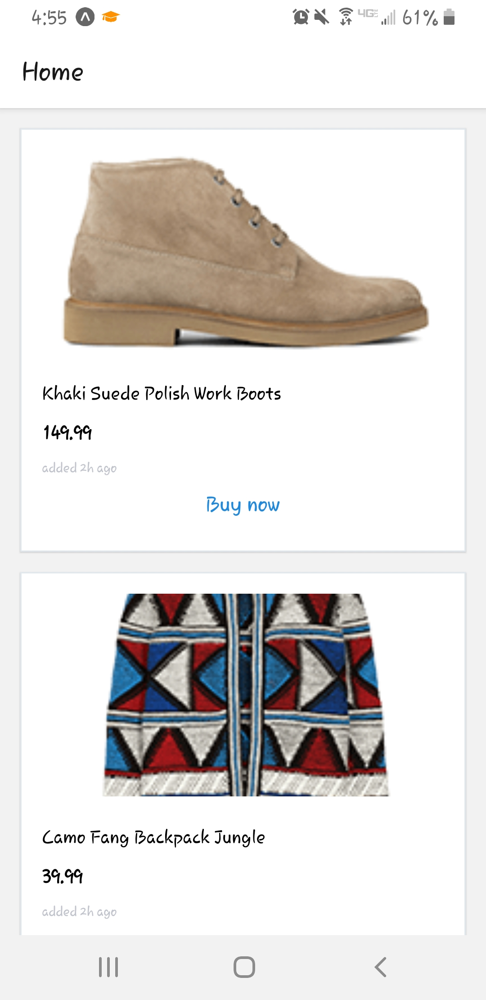
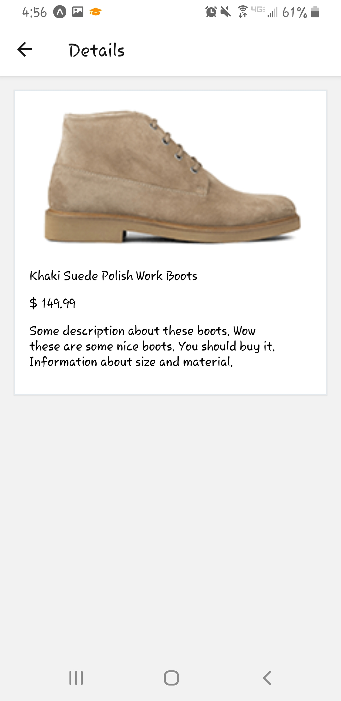

# Hack Technology / Project Attempted

## What I built

I attempted to build a simple react-native e-commerce application that displays items for sell and have a details page for each item. I wanted to include page navigation that links the different pages of my app. I also wanted to include shopping cart and checkout features to my app to complete the e-commerce experience, but I was unable to finish this part of the app. Some of the code that I tried is in this repo, though I had to remove some parts that would connect the shopping cart with my app to get the original, basic version running again. Given the time, I also wanted to add a login page for my app, since this seems like a pretty common feature that most apps have and would be helpful to learn for the final project. But since I wasn't able to get the shopping cart working, I did not get to work on this feature either.

Here are some screenshots of what my app looks like right now:
 

## Who Did What?

I worked on this by myself.

## What I learned

I was able to get the home screen and product details screen working, as well as navigation between these two pages. However, because I am still not very familiar with react-native, I was still working on getting the shopping cart and checkout page working, which I was not able to complete for this hack-a-thing. I might spend a bit of time later to work on this though, since I think that react-native is a very useful skill that I will probably be using for my final project. Even if I don't use it here, I believe that having some experience with frontend/UIs will be useful to me in the future. Unfortunately, I haven't had much of an opportunity to work on the frontend before this class, and I am glad that I've had this opportunity to learn a bit about it now, even though I was not able to get very far with this project. Overall, I think enjoyed working on this project and do not object to making a mobile app that uses react-native, though I would want to be a bit more familiar with it before I can efficiently work on a project with this tool.

## Authors

Joanna Liu

## Acknowledgments

Tutorial for basic ecommerce page: https://codesource.io/e-commerce-app-with-react-native/
Reference for shopping cart: https://medium.com/@ayabellazreg/make-a-simple-shopping-cart-app-using-react-redux-part-2-88117cf1c069
